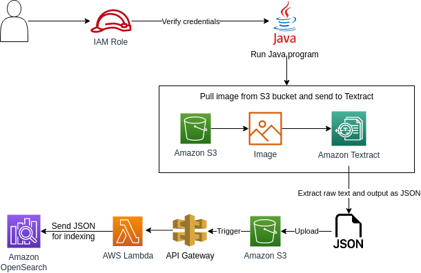
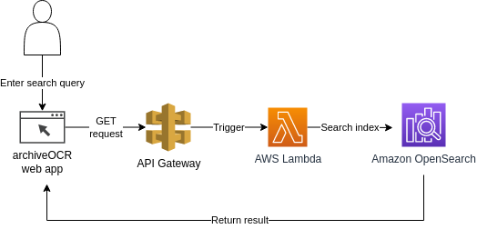
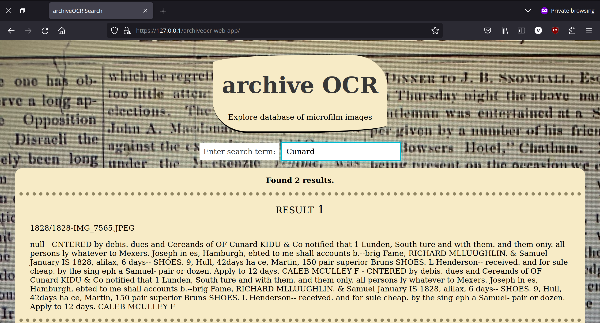

# archiveOCR: Microfilm Search

|   |   |
|---|---|
   |    

Using AWS Services, converts an image archive of newspaper articles on microfilm into searchable text, with a front-end web application for the search function.

The aim is to easily find relevant articles (among 10,000+ images) using a keyword search, returning both the filename and transcription of the content. 

## How It Works:

User uploads image to an S3 bucket. User runs Java program to run Amazon Textract on the image; this requires specifying the image filename at runtime. The image is converted into text using Textract, with the text being sent as a JSON file to a second S3 bucket. Through an API Gateway, an AWS Lambda ("s3-to-opensearch") automatically sends this file for indexing to Amazon OpenSearch. 

In the front-end web application, user enters a search query of >2 characters. An API Gateway connects to a second Lambda ("opensearch-query") which queries the OpenSearch index for any files containing text that matches the query term. The web application displays the results, i.e. either no matching search terms found, or the filename and text contents that were saved in the JSON file. 

The images below show screenshots of the web application in action.

| Search in progress  | No result  | Successful search  |
|---|---|---|
 |  | 

## AWS Services

- AWS S3
    - "microfilms" bucket: hold raw jpeg files.
    - "textract-microfilms" bucket: hold json files of the extracted text.
- Amazon OpenSearch Service
    - Create own domain with following configuration:
       - Cluster config: 1 AZ (sufficient for purposes of testing), t3.small.search instance, public network access (IPv4, dual stack).
       - Security config: no fine-grained access control, create access policy restricting access to this OpenSearch domain by IP address (i.e. for resource "awn:aws:es:us-east-1:{account_no}:domain/my-domain/*", add Condition -> IpAddress -> aws:SourceIp for my own IP address to access this resource).
    - In dashboard for this OpenSearch domain, add S3 bucket ("textract-microfilms") as data source.
- API Gateway
    - "opensearch-indexing": deploy API with "ANY" method, return response body as content type application/json.
    - "opensearch-query": deploy API with a "GET" method type, require URL query string parameter ("q"), return response body as content type application/json.
- Lambda
    - "s3-to-opensearch": set 2 triggers, 1) API Gateway, specifically the "opensearch-indexing" REST API, 2) S3 bucket "textract-microfilms" for Object Created event.
    - "opensearch-query": set 1 trigger for API Gateway "opensearch-query" REST API.
- IAM
    - User Groups: "programmers" with PowerUserAccess policy to allow access to AWS Services via the AWS Toolkit plugin in IntelliJ IDE.
    - Users: "power-user", belongs to "programmers" group.
    - Roles: "s3-to-opensearch-role" with AWSLambdaS3ExecutionRole policy to allow s3:GetObject and AWSLambdaElasticsearchExecutionRole policy to allow es:ESHttpPost and es:ESHttpGet; "opensearch-query-role" with AmazonOpenSearchServiceReadOnlyAccess policy and AWSLambdaElasticsearchExecutionRole policy.
- Other tools used: CloudWatch for troubleshooting lambdas, Billing and Cost Management to set monthly budget amount and alerts for three cost thresholds.

### Limitations

Two key limitations are transcription accuracy and cost: 
1. Textract has some difficulty accurately extracting text from these images, which are all images of old newspapers on microfilm and often have blurred letters, bleedthrough, and darkened areas that may be challenging for OCR technology. However, by returning the filename, it makes it easy to simply locate and open up the file to read the article contents in its original form. Again, the primary purpose was to make the archive searchable, which this project has achieved. For the most part, keywords like people's names, locations, and years are transcribed accurately.
2. Amazon's OpenSearch Service is a costly tool, making this project less viable for daily use and/or for uploading all 10,000+ images and periodically conducting searches on this large collection. A potential future project is making an open source version of this project using Tesseract instead of Amazon Textract, and self-host it to reduce costs. Tesseract allows you to train on your own data, so the results may also be more accurate given that all 10,000+ images are very similar in quality and appearance.
